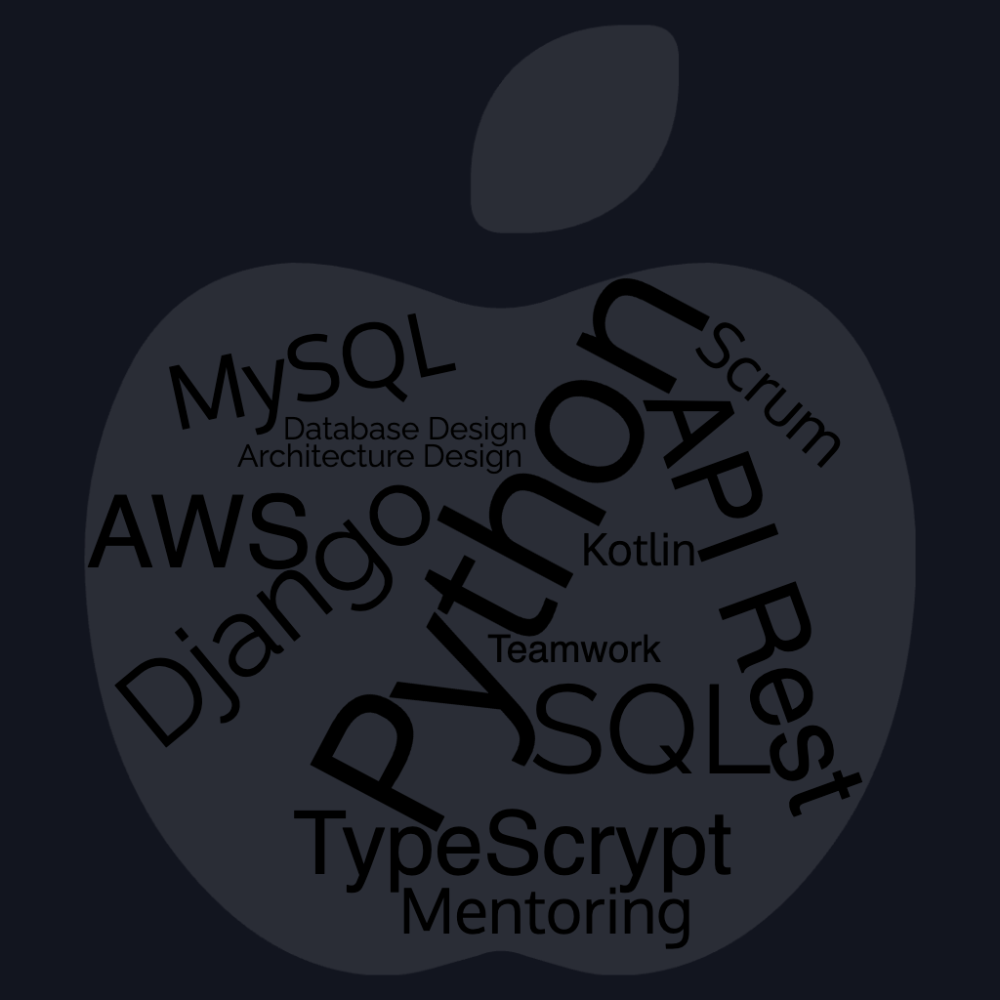

<h1>Natalia Cortese</h1>

# Work experience
- <strong>Position:</strong> Senior Software Engineer 
  <strong>Duration:</strong> 2017 - 2024 
  <strong>Employer:</strong> <a href="www.eventbrite.com">Eventbrite</a>  
  <strong>Responsibilities:</strong> 
  - Developed and designed REST API integrations using Python for renowned partners such as Facebook and Google. 
  - Spearheaded ETL design initiatives for reporting applications and facilitated seamless data migration processes. 
  - Contributed to architecture design for novel services deployed in AWS, ensuring scalability and efficiency. 
  - Led database design efforts to support the implementation of new features and integrations with external partners. 

- <strong>Position:</strong> Senior Business Intelligence / Data Mining Analyst 
  <strong>Duration:</strong> 2009 - 2017 
  <strong>Employer:</strong> OSEP  
  <strong>Responsibilities:</strong> 
  - Analyzed health data and statistics of benefits consumption for the Health Data Board. 
  - Utilized SAP tools, Crystal Report, Business Object, SQL Server 2000/2005, Analysis Server, and Data Mining techniques. 
  - Employed Carto, PL/SQL, and Tableau for dashboard building and data visualization. 

- <strong>Position:</strong> Junior Developer 
  <strong>Duration:</strong> 2008 
  <strong>Employer:</strong> <a href="https://www.inamika.com/es/index.html">www.inamika.com</a> 
  <strong>Responsibilities:</strong> Build and design desktop applications in Delphi. 

- <strong>Position:</strong> Junior Developer 
  <strong>Duration:</strong> 2006 - 2008 
  <strong>Employer:</strong> Registro Nacional de Las Personas 
  <strong>Responsibilities:</strong> Build and design desktop applications in Delphi. 
  <strong>Website:</strong> <a href="https://www.argentina.gob.ar/interior/renaper">RenaPer</a> 

# COURSERA:
  - Data Structure in Python
    link: <a href="https://www.coursera.org/learn/estructura-de-datos-python/home/welcome">Estructuras de datos en Python</a>
    date: March 1, 2020

# CISCO:
  - DBA ORACLE 9i
    link: <a href="http://www.frm.utn.edu.ar/index.php?option=com_content&view=article&id=3449:academias-cisco-oracle-y-sun-utn-frm-cursos-y-carreras-de-informatica-aplicada&catid=77:noticias-facultad-regional-mendoza&Itemid=487">UTN-FRM</a>
    date: 2008

# IBM:
  - DBA DB2
    link: <url>https://www.ibm.com/products/db2-database</url>
      
# UTN - FRM: 
  - Degree on Bussiness Intelligence
    Info: Diplomatura en Business Intelligence
    link: <url>www.utn.frba.com.ar</url>
    
# AWS Training
  - <a href="https://www.linkedin.com/in/nataliacortese/#:~:text=fecha%20de%20vencimiento-,Ver%20credencial,-Diplomatura%20en%20Business">AWS Technical Essentials</a>
    Info: Completion Certificate
    Emisión: 10/2021
    Autoridad Emisora: AWS Training
    
  - <a href="https://www.aws.training/Transcript/CompletionCertificateHtml?transcriptid=1-e-JcBmnkumCuSEQUglnA2">Developing on AWS</a>
  Info: Completion Certificate
  Emisión: 11/2021
  Autoridad Emisora: AWS Training
      
# Blogging:
- Post: <a href="https://www.eventbrite.com.ar/engineering/ser-el-cambio/" target="_blank">Be the change</a>
- Post: <a href="https://www.eventbrite.com/engineering/open-data-what-why-and-how/" target="_blank">Open Data Why and How</a>

# Dev Profiles:
  - <a href="https://www.hackerrank.com/NatuC" target="_blank">Hackerrank</a>
  - <a href="https://www.codewars.com/users/Nats" target="_blank">Codewars</a>

# My Repos:
 - <a href="https://github.com/natalia-cortese/machine_learning">Working on ML</a>
 - <a href="https://github.com/natalia-cortese/python">Python learning</a>
 - <a href="https://github.com/natalia-cortese/Codewars">Codewars Solutions</a>

# About Me:
  "My professional aspiration is to continually evolve as a software developer. I am a self-motivated individual with a strong aptitude for adapting to new environments and constantly expanding my knowledge base.
  My primary expertise lies in Python, complemented by proficiency in backend languages such as Delphi, C#, and Java, as well as frontend development with React. I have also undergone management training in relational databases, including Oracle, DB2, and SQL Server, along with non-relational databases like Redis.
  With four years of experience in developing SAP Business Solutions, I bring a blend of curiosity and tenacity to my work as a software developer. I am eagerly seeking opportunities to further my growth and continue learning in this dynamic field."

# Contact Me
<a href="https://www.linkedin.com/in/nataliacortese/" target="_blank">https://www.linkedin.com/in/nataliacortese/</a>

  Mendoza, Argentina  
  Valencia, España  
  Software Developer  
